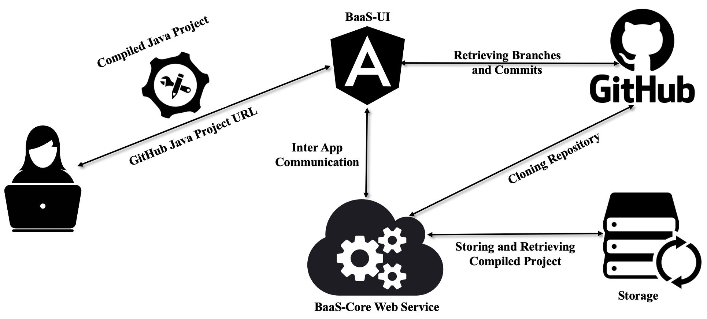

# Build as a Service: BaaS
BaaS is a service that helps users to instantly build an arbitrary Java projects hosted on GitHub.
It is designed in two distinct modules, BaaS-UI and BaaS-Core.




## BaaS-Core

BaaS-Core is a microservice employing the [JBF](https://github.com/Mondego/SourcererJBF) architecture.
It receives a build request from BaaS-UI and downloads the latest
version of the user given repository’s branch. Then it attempts to build that repository.
After building the project, it makes a package of build artifacts and sends
a downloadable link of that package to the BaaS-UI as a response to the build request.
The service is implemented in Python [Flask](https://pypi.org/project/Flask/)  application that triggers JBF execution on user given build request.

## BaaS-UI
BaaS-UI is a front-end [Angular](https://angular.io)  web application that provides a web interface to the
users. It allows the users to give a Java repository GitHub URL and branch as
input and displays the build-project overview, statistics, build status, and the downloadable
package link. Users download the build package with this link. BaaS-UI also provides a dashboard showing the current status of the service and the available compiled projects.


### BaaS Works in Action
https://user-images.githubusercontent.com/6449333/170947458-9c938f46-6e5f-4a50-b7c6-f62640f792a2.mp4


### Environment Setup & Requirements

- [Node.js](https://nodejs.org/en/): version 16+
- [NPM](https://docs.npmjs.com/about-npm): version 8+
- [Angular CLI](https://angular.io/cli): version 13.3.3+
- [Python](https://www.python.org/): version 3.9+ with the following packages
    - [Flask](https://pypi.org/project/Flask/)
    - [subprocess32](https://pypi.org/project/subprocess32/)
    - [chardet](https://pypi.org/project/chardet/)
    - [simplejson](https://pypi.org/project/simplejson/)


* ### Run BaaS-Core (Backend)
BaaS-Core a web service wrapper of [JBF](https://github.com/Mondego/SourcererJBF) that executed JBF on a single project.
Since it is built on top of JBF, to run it first edit ``jbf.config``. Please read the details here, how to update the [jbf.config](https://github.com/Mondego/SourcererJBF/blob/master/README.md).
BaaS-Core fully relied on JBF generated FQN index and Jar collection and these two are host machine dependent.
Therefore, you need a ***pre-constructed FQN index*** that maps a Jar collection on the host machine. Now to run the service, execute the following commands and the BaaS-Core will be available on [http://127.0.0.1:5000/](http://127.0.0.1:5000/)

```bash
cd BaaS-Core
python3 jbf.web.py
```

* ### Run BaaS-UI (Frontend)
BaaS saves project information in Firebase database. Therefore, before running BaaS-UI, 
first create a ``service.json`` to save firebase credential in the root directory of BaaS-UI.
Also to consume request from ``BaaS-Core`` set the base ``backendBaseUrl`` (http://127.0.0.1:5000/) in the  Angular environment 
``baas/BaaS-UI/src/environment/``. Then run the server. 
You will see the BaaS-UI is running in [http://localhost:4200](http://localhost:4200)

```bash
cd BaaS-UI
npm install
ng serve
```


### Note
Currently, ***we are hosting BaaS on request***. We have a large collection of Jars and the pre-constructed FQN index.
We successfully compiled ***91,076 Java projects*** with our Jar collection. 
If you need to try BaaS in your work, please contact us to this email [mdrh@uic.edu](mdrh@uci.edu).
We will host BaaS for you and allow you to utilize it for instantly build GitHub Java projects.
